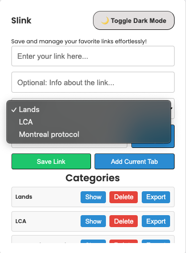
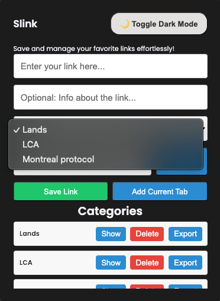
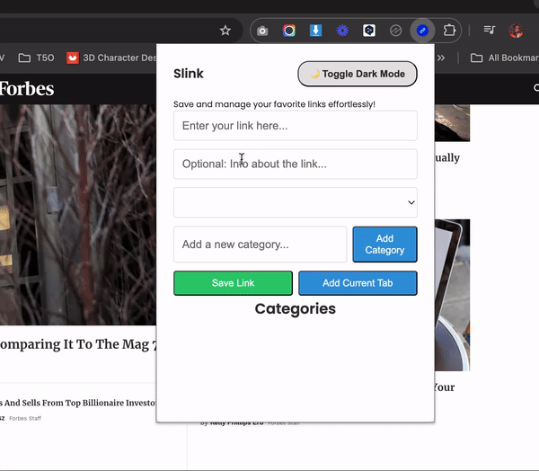

Here's the **README.md** for "Slink - Link Manager" Chrome Extension. This document includes sections like **Overview**, **Features**, **Installation**, **Usage**, **Permissions**, and **Contributions**.

---

## 📌 **Slink - Link Manager**

Slink is a powerful **Chrome Extension** designed to help users efficiently manage, organize, and access their links. Whether you want to save links into categories, add notes, or export your saved links, Slink provides a seamless and visually appealing interface to do it all.

---

### 🚀 **Overview**

Slink allows you to:
1. **Save links** into organized categories.
2. **Add notes/info** to each saved link for better understanding.
3. **Add the current active browser tab** to a selected category.
4. **Export your links** into an Excel file for easy sharing or backup.
5. **Expand categories** to see links with their corresponding notes.
6. Use a **Dark Mode** for comfortable viewing at night.

With Slink, managing your online resources has never been this easy!

---

### 🛠 **Features**

1. **Save Links**  
   - Add any link manually into organized categories.
   - Add notes/info to each link (optional).

2. **Add Current Tab**  
   - Quickly add the current browser tab's URL into a selected category.

3. **Organize into Categories**  
   - Create, view, and manage multiple categories.  
   - Expand a category to see all its saved links with their notes.  
   - Delete or export any category.

4. **Dark Mode**  
   - Toggle dark mode for a visually comfortable experience.

5. **Export to Excel**  
   - Export all links under a category into an Excel file with their notes.

6. **Responsive and Intuitive UI**  
   - Sleek, clean, and user-friendly interface.

---

### 🎥 **Screenshots**

| **Light Mode**                        | **Dark Mode**                        |
| ------------------------------------- | ------------------------------------- |
|      |       |

---

### 🧩 **Installation**

1. **Download the Extension Files**  
   - Download or clone this repository to your local computer.

   ```bash
   git clone https://github.com/DigitalPool/SlinkMan.git
   ```

2. **Load the Extension into Chrome**  
   - Open Chrome and navigate to `chrome://extensions/`.
   - Enable **Developer mode** (toggle at the top right corner).
   - Click on **"Load unpacked"** and select the downloaded folder.
   - Slink should now appear in your Chrome Extensions list.

3. **Pin the Extension**  
   - Pin Slink to the Chrome toolbar for easy access.

---

### 💻 **Usage**

1. **Launch Slink**  
   - Click the Slink icon in your Chrome toolbar.

2. **Add Links**  
   - **Manually**: Type a link and optional note into the input field, choose a category, and click **Save Link**.  
   - **From Current Tab**: Click **"Add Current Tab"** to save the current URL.

3. **Manage Categories**  
   - Use the dropdown to organize links into specific categories.  
   - Add new categories using the "Add Category" field and button.  
   - Expand any category using the **Show** button to see all saved links with notes.

4. **Export Links**  
   - Use the **Export** button next to any category to download all links and notes as an Excel file.

5. **Delete Categories**  
   - Click the **Delete Category** button to remove a category and all its links.

6. **Dark Mode**  
   - Toggle dark mode using the **🌙 Toggle Dark Mode** button at the top.

---

### 📜 **Permissions**

This extension requires the following permissions:

1. **"tabs"**: To fetch the current active browser tab's URL.
2. **"storage"**: To store saved links, categories, and user settings (e.g., Dark Mode preference).

These permissions ensure the extension functions as intended without collecting or sharing any user data.

---

### 🌟 **Demo**

   

---

### 📦 **Folder Structure**

```plaintext
slink-link-manager/
│
├── manifest.json          # Chrome extension configuration
├── index.html             # Main extension popup UI
├── style.css              # Stylesheet for UI
├── script.js              # Main logic and functionality
├── README.md              # Documentation
└── res/                   # Folder for images/icons
    ├── icon.png
    ├── demo-light.png
    └── demo-dark.png
```

---

### 🛡 **Privacy Policy**

Slink does not collect or share your data. All links and notes are stored locally on your browser.

---

### 🤝 **Contributions**

Contributions are welcome! Follow these steps to contribute:

1. Fork the repository.
2. Create a new branch:  
   ```bash
   git checkout -b feature/your-feature-name
   ```
3. Commit your changes:  
   ```bash
   git commit -m "Add your feature"
   ```
4. Push to the branch:  
   ```bash
   git push origin feature/your-feature-name
   ```
5. Open a Pull Request.

---

### 📧 **Contact**

For questions, issues, or feedback, please contact:  
**Your Name**  
📧 [digitalpoolng@gmail.com](mailto:digitalpoolng@gmail.com)  
🔗 [GitHub Profile](https://github.com/DigitalPool)

---

### ⭐ **Show Your Support**

If you find Slink useful, feel free to ⭐ the repository and share it with others.

---

### 🏷 **License**

This project is licensed under the **MIT License**. See the `LICENSE` file for details.

---

With this README, users and developers will have a clear understanding of your project, its functionality, and how to use or contribute to it. Let me know if you want any further improvements! 🚀
